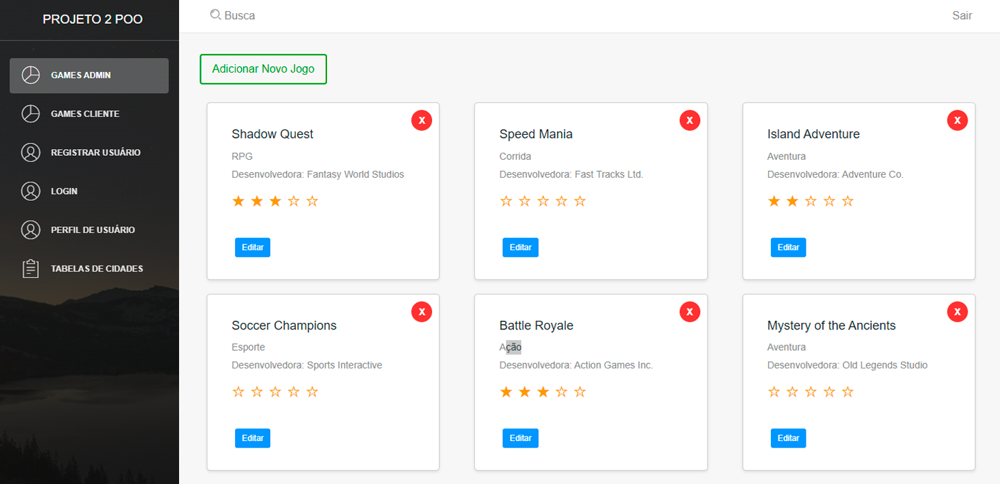

# Trabalho Prático 2 - POO2 

> Sistema de Gerenciamento de Vendas de Jogos

Este projeto é uma aplicação Vue.js desenvolvida para o Trabalho Prático 2 da disciplina de Programação Orientada a Objetos II. O sistema é dedicado ao gerenciamento de vendas de jogos eletrônicos, com funcionalidades para cadastro de jogos, desenvolvedoras, clientes, gerentes, e controle de vendas em mídias físicas e digitais.

## :page_facing_up: Especificação do Trabalho

- Implementação de um sistema para uma empresa fictícia de vendas de jogos eletrônicos.
- O sistema deve ser totalmente Orientado a Objetos e aplicar padrões de projeto indicados, incluindo MVC.
- Suporte para dois tipos de usuários: Clientes (incluindo Cliente Épico com desconto) e Gerentes.
- Cadastro de jogos de diferentes gêneros e desenvolvedoras.
- Funcionalidade para avaliação de jogos pelos clientes.
- Gerenciamento de vendas, incluindo a escolha de mídia (física ou digital), seleção de transportadora para mídias físicas, e métodos de pagamento variados (Boleto Bancário, Cartão de Crédito, PIX).
- Armazenamento de dados em arquivos e interface gráfica para interação.
- Relatórios detalhados sobre jogos, desenvolvedoras, transportadoras, vendas e usuários.

## :rocket: Começando

O sistema é construído com Vue.js, Vuex e Vue-router. Para começar, siga os seguintes passos:

1. Baixe o projeto.
2. Certifique-se de ter o node.js instalado (https://nodejs.org/en/).
3. Digite `npm install` na pasta fonte onde o `package.json` está localizado.
4. Digite `npm run dev` para iniciar o servidor de desenvolvimento.

## :cloud: Configuração de Build

### Instale as dependências

`npm install`

### Sirva com recarga a quente em localhost:8000

`npm run dev`

### Construa para produção com minificação

`npm run build`

### Execute testes unitários

`npm run unit`

### Execute e observe os testes unitários

`npm run unit:watch`

## :clipboard: Guia de Contribuição

- `npm install` ou `yarn install`
- Evite o uso de jQuery ou plugins baseados em jQuery, já que existem muitas alternativas puras em Vue

Para mais detalhes sobre a implementação e os padrões de projeto, consulte o [guia](http://vuejs-templates.github.io/webpack/) e [documentação do vue-loader](http://vuejs.github.io/vue-loader).

[changelog]: ./CHANGELOG.md
[license]: ./LICENSE.md
[version-badge]: https://img.shields.io/badge/version-1.0.0-blue.svg
[license-badge]: https://img.shields.io/badge/license-MIT-blue.svg
